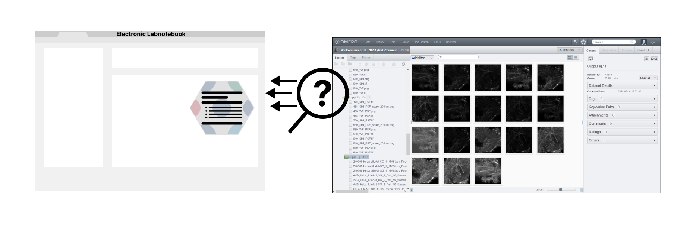

<!-- TABLE OF CONTENTS -->

  
Table of Contents

  <ol>
    <li>
      <a href="#about-the-project">About The Project</a>
      <ul>
        <li><a href="#built-with">Built With</a></li>
      </ul>
    </li>
    <li>
      <a href="#getting-started">Getting Started</a>
      <ul>
        <li><a href="#prerequisites">Prerequisites</a></li>
        <li><a href="#installation">Installation</a></li>
      </ul>
    </li>
    <li><a href="#usage">Usage</a></li>
    <li><a href="#roadmap">Roadmap</a></li>
    <li><a href="#contributing">Contributing</a></li>
    <li><a href="#license">License</a></li>
    <li><a href="#contact">Contact</a></li>
    <li><a href="#acknowledgments">Acknowledgments</a></li>
  </ol>

<!-- ABOUT THE PROJECT -->
## About The Project

The omero-eln-dataBridgeTools  are designed to link bioimage metadata stored in OMERO with the relevant experimental metadata found in an Electronic Lab Notebook (ELN). 
Utilizing these tools allows you to save time on metadata searches, access your image metadata directly within the ELN, and facilitates easier retrieval of project metadata for your students or supervisor.

We developed two different toolboxes to link and display metadata:

### [omero_JSONQueryToolbox:](omero_JSONQueryToolbox.md)
This toolbox requires the user to insert the OMERO image or dataset ID into the ELN. The OMERO image metadata is then requested and displayed in the ELN. 
This data is updated each time the ELN entry is edited. By adding or deleting OMERO image IDs these are appended to or disappear from the metadata table displayed in the ELN.
   
### [omero_LinkageToolbox:](omero_LinkageToolbox.md)
With this toolbox, users must either paste the URL of the experiment in the ELN into OMERO or drag and drop it there. A new entry with the image metadata is then created in the ELN and a link to the experiment in the ELN is created in OMERO. To update the OMERO image data linked to the ELN experiment, simply run the toolbox again and remove the previous result.

Different levels of access rights to the OMERO and/or ELN server are required to install the toolboxes, so be sure to review the prerequisites beforehand.

Both toolboxes do not contradict each other, it is possible to install and use both of them.

<!-- ROADMAP -->
## Roadmap future developments

- [ ] elabFTW *.eln output for omero_LinkageToolbox
- [ ] Synchronizing function for omero_LinkageToolbox: Automatically update or synchronize content for existing links

See the [open issues][open-issues] for a full list of proposed features (and known issues). TODO: set templates

<!-- VERSIONING -->
## Versioning
We use [SemVer](http://semver.org/) for versioning. For the versions available, see the [tags on this repository][tags-url].

<!-- CONTRIBUTING -->
## Contributing

Please read [CONTRIBUTING.md](CONTRIBUTING.md)

<!-- LICENSE -->
## License

Distributed under the AGPL-3.0 License. See `LICENSE.txt` for more information.

<!-- CONTACT -->
## Contact

Project Link: [I3D:bio - Information Infrastructure for BioImage Data][I3D:bio-url]

<!-- ACKNOWLEDGMENTS -->
## Acknowledgments

The this project is part of the I3D:bio project, funded by the Deutsche Forschungsgemeinschaft (DFG, German Research Foundation). Grant Number: 462231789

(<a href="#readme-top">back to top</a>)

<!-- MARKDOWN LINKS & IMAGES -->
[open-issues]: https://github.com/I3D-bio/omero-eln-dataBridgeTools/issues
[tags-url]: https://github.com/I3D-bio/omero-eln-dataBridgeTools/tags
[I3D:bio-url]: https://gerbi-gmb.de/i3dbio/

<!-- https://www.markdownguide.org/basic-syntax/#reference-style-links -->
[contributors-shield]: https://img.shields.io/github/contributors/I3D-bio/omero-eln-dataBridgeTools.svg?style=for-the-badge
[contributors-url]: https://github.com/I3D-bio/omero-eln-dataBridgeTools/graphs/contributors
[forks-shield]: https://img.shields.io/github/forks/othneildrew/Best-README-Template.svg?style=for-the-badge
[forks-url]: https://github.com/I3D-bio/omero-eln-dataBridgeTools/network/members
[stars-shield]: https://img.shields.io/github/stars/I3D-bio/omero-eln-dataBridgeTools.svg?style=for-the-badge
[stars-url]: https://github.com/I3D-bio/omero-eln-dataBridgeTools/stargazers
[issues-shield]: https://img.shields.io/github/issues/I3D-bio/omero-eln-dataBridgeTools.svg?style=for-the-badge
[issues-url]: https://github.com/I3D-bio/omero-eln-dataBridgeTools/issues
[license-shield]: https://img.shields.io/github/license/I3D-bio/omero-eln-dataBridgeTools.svg?style=for-the-badge
[license-url]: https://github.com/I3D-bio/omero-eln-dataBridgeTools/blob/master/LICENSE.txt

[short_ELN_queryData]: images/short_ELN_queryData.png

[short_ELN_q2]: 

